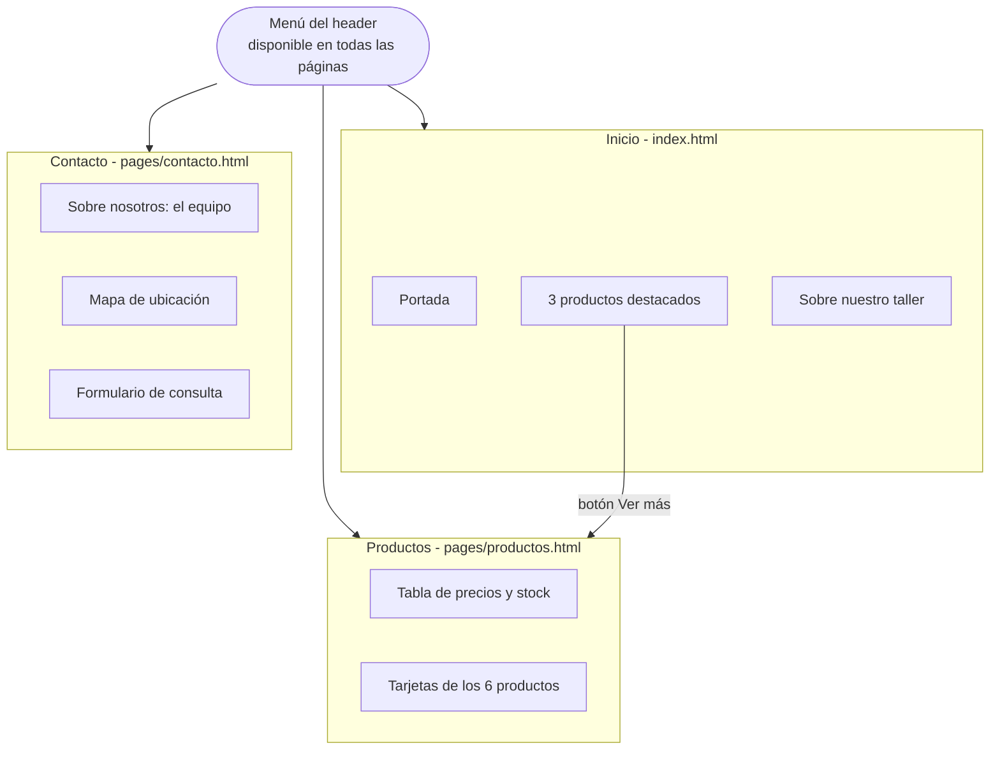

# ARTESANO - Cerámica Artesanal

Sitio web institucional y de catálogo para **ARTESANO**, un taller de cerámica hecha a mano. Es la entrega intermedia del curso de Front End: un sitio estático de tres páginas hecho solo con HTML y CSS.

El sitio permite a un visitante conocer el taller, ver los productos con su precio y su disponibilidad de stock, y encontrar cómo contactarse con el equipo.

## Qué hace el sitio

### Inicio (`index.html`)
- Portada con la presentación del taller.
- Tres **productos destacados** (Plato en Gres, Taza Artesanal y Jarra Decorativa) con imagen, descripción, precio y un botón "Ver más" que lleva al catálogo.
- Sección "Sobre Nuestro Taller" con la historia y los materiales con los que trabajan (gres, porcelana y arcilla).

### Productos (`pages/productos.html`)
- **Tabla de precios y stock** de los 6 productos, con el stock marcado en verde (Sí) o rojo (No).
- **Tarjetas de producto** con imagen, descripción, precio y botón "Comprar".
- Los productos **sin stock** (Maceta y Jarra) muestran la imagen con el sello "SIN STOCK" y el botón "Comprar" desactivado en gris (clase `btn--disabled`).

### Contacto (`pages/contacto.html`)
- "Sobre Nosotros": presentación del equipo del taller (Mauro, Eleonora y Juan) y una foto del taller.
- **Mapa de Google Maps** incrustado con la ubicación del taller.
- **Formulario de consulta** con nombre, email, teléfono, consulta, método de contacto preferido y producto de interés. Las consultas se envían por email mediante [Formspree](https://formspree.io), sin necesidad de backend propio.

## Diagramas

### Mapa del sitio



## Estructura del proyecto

```
trabajo_final/
├── index.html            # Página de inicio
├── pages/
│   ├── productos.html    # Catálogo de productos
│   └── contacto.html     # Equipo, mapa y formulario
├── css/
│   └── styles.css        # Estilos de todo el sitio
└── img/                  # Logo y fotos de productos y del taller
```

## Tecnologías

- **HTML5** semántico (`header`, `nav`, `main`, `section`, `article`, `footer`).
- **CSS3** con Flexbox y una hoja de estilos única para todo el sitio, con clases nombradas según la metodología BEM (por ejemplo `card__title` o `btn--disabled`).
- **Google Fonts**: Playfair Display para los títulos y Roboto para el texto.
- **Google Maps** incrustado con un `iframe`.
- **Formspree** para recibir por email las consultas del formulario de contacto.

No usa JavaScript ni frameworks.

## Limitaciones actuales

- El botón "Comprar" no realiza ninguna compra; el sitio es un catálogo informativo.
- El plan gratuito de Formspree tiene un límite mensual de consultas.

## Autor

Mauro Colombini
